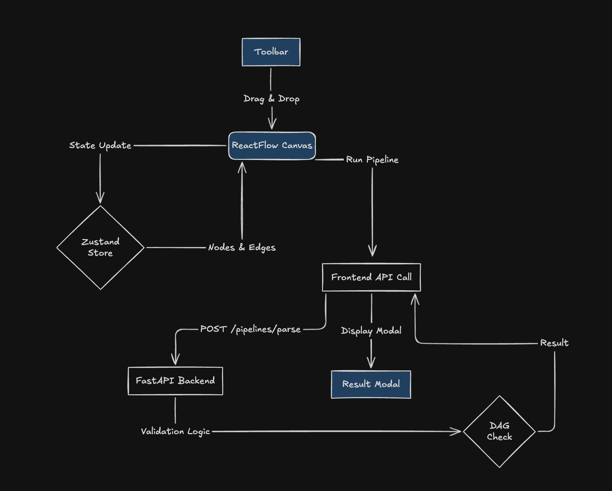

# VectorShift Pipeline Builder

A professional, industrial-grade pipeline builder built with **ReactFlow**, **FastAPI**, and **Tailwind CSS**. This tool allows users to design complex workflows through a drag-and-drop interface, with real-time backend validation for graph integrity.


## 🚀 Features

- **Drag-and-Drop Interface**: Easily build workflows by dragging nodes from the categorized toolbar.
- **Rich Node Library**:
  - **I/O**: Input, Output, and Text nodes.
  - **Logic**: Filters, Conditionals, and Aggregators.
  - **Tools**: LLM integration, API calls, and Data Transforms.
- **Smart Validation**: Real-time DAG (Directed Acyclic Graph) detection using Kahn's algorithm on the backend.
- **Interactive Design**:
  - **Industrial Light Theme**: Clean, crisp UI inspired by modern developer tools.
  - **Deletion Support**: Intuitive "X" buttons on both nodes and edges.
  - **Keyboard Shortcuts**: `Cmd/Ctrl + Enter` to run the analysis instantly.
- **Responsive Layout**: Designed for high-precision workflow editing.

## 🧩 Node Reference

### 📥 I/O Nodes

- **Input Node**: The entry point for your pipeline. Configure a field name and select the data type (Text or File).
- **Output Node**: The exit point for your pipeline. Specify a name and output type (Text or Image).
- **Text Node**: A versatile text area for static or dynamic content.
  - **Auto-Variable Detection**: Typing `{{variable_name}}` automatically creates a new input handle on the left side, allowing you to inject dynamic data into your text.

### ⚙️ Logic Nodes

- **Filter Node**: Filters incoming data based on string patterns (Contains, Equals, Starts With, Ends With).
- **Conditional Node**: A logic gate that routes data to `True` or `False` outputs based on comparison operators (`>`, `<`, `===`, `!==`) and a defined threshold.
- **Aggregator Node**: Collects and merges multiple inputs into a single data stream for downstream processing.

### 🛠 Tools Nodes

- **LLM Node**: Connects your pipeline to a Large Language Model. Features dedicated handles for `System` (instructions) and `Prompt` (user query).
- **Transform Node**: A generic data transformation node used for custom processing logic.
- **API Node**: Enables your pipeline to interact with external services via standard web requests.

## 🛠 Tech Stack

- **Frontend**: React (Vite), ReactFlow, Zustand, Framer Motion, Tailwind CSS, Lucide Icons.
- **Backend**: Python, FastAPI, Pydantic, Uvicorn.

---

## 🏗 System Flow



## 🚦 Getting Started

### Backend

1. Navigate to the backend directory:
   ```bash
   cd backend
   ```
2. Start the server:
   ```bash
   python -m uvicorn main:app --reload
   ```

### Frontend

1. Navigate to the client directory:
   ```bash
   cd client
   ```
2. Install dependencies:
   ```bash
   npm install
   ```
3. Start the development server:
   ```bash
   npm start
   ```

## 🧪 Testing

The backend includes a specialized test suite to ensure graph validation correctness:

```bash
cd backend
python3 test_dag.py
```

---
