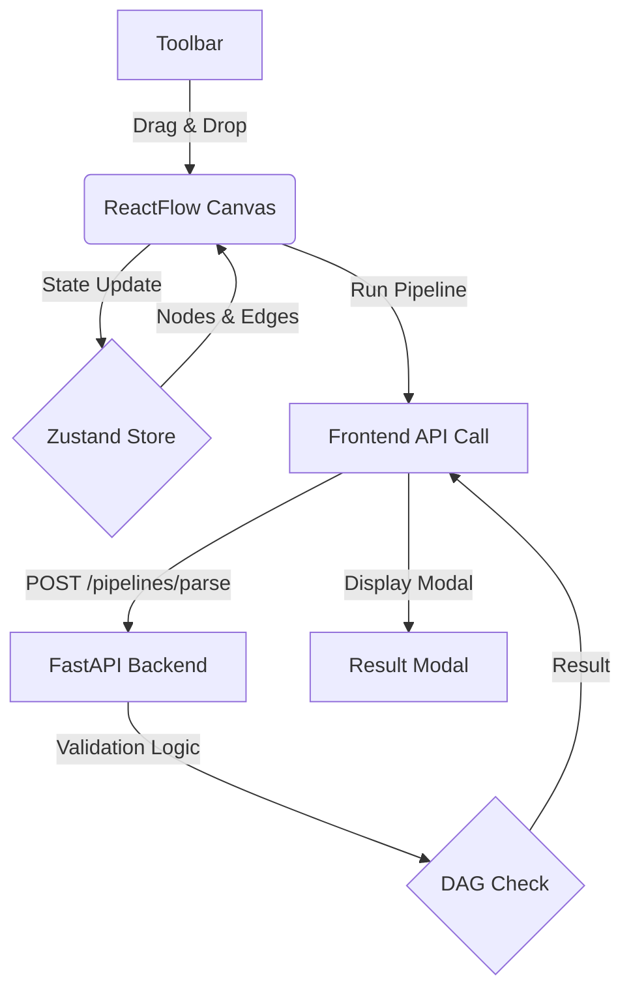

# VectorShift Pipeline Builder

A professional, industrial-grade pipeline builder built with **ReactFlow**, **FastAPI**, and **Tailwind CSS**. This tool allows users to design complex workflows through a drag-and-drop interface, with real-time backend validation for graph integrity.


## 🚀 Features

- **Drag-and-Drop Interface**: Easily build workflows by dragging nodes from the categorized toolbar.
- **Rich Node Library**:
  - **I/O**: Input, Output, and Text nodes.
  - **Logic**: Filters, Conditionals, and Aggregators.
  - **Tools**: LLM integration, API calls, and Data Transforms.
- **Smart Validation**: Real-time DAG (Directed Acyclic Graph) detection using Kahn's algorithm on the backend.
- **Interactive Design**:
  - **Industrial Light Theme**: Clean, crisp UI inspired by modern developer tools.
  - **Deletion Support**: Intuitive "X" buttons on both nodes and edges.
  - **Keyboard Shortcuts**: `Cmd/Ctrl + Enter` to run the analysis instantly.
- **Responsive Layout**: Designed for high-precision workflow editing.

## 🛠 Tech Stack

- **Frontend**: React (Vite), ReactFlow, Zustand, Framer Motion, Tailwind CSS, Lucide Icons.
- **Backend**: Python, FastAPI, Pydantic, Uvicorn.

---

## 🏗 System Flow



## 📂 Project Structure

```bash
vectorShift/
├── backend/
│   ├── main.py          # FastAPI server with DAG validation
│   └── test_dag.py      # Automated tests for graph logic
└── client/
    ├── src/
    │   ├── nodes/       # Custom ReactFlow node components
    │   ├── components/  # Shared UI components (DeletableEdge, etc.)
    │   ├── store.jsx    # Zustand state management
    │   ├── ui.jsx       # Main ReactFlow playground
    │   └── toolbar.jsx  # Categorized node toolbar
    └── App.css          # Global industrial theme variables
```

## 🚦 Getting Started

### Backend

1. Navigate to the backend directory:
   ```bash
   cd backend
   ```
2. Start the server:
   ```bash
   python -m uvicorn main:app --reload
   ```

### Frontend

1. Navigate to the client directory:
   ```bash
   cd client
   ```
2. Install dependencies:
   ```bash
   npm install
   ```
3. Start the development server:
   ```bash
   npm run dev
   ```

## 🧪 Testing

The backend includes a specialized test suite to ensure graph validation correctness:

```bash
cd backend
python3 test_dag.py
```

---

_Designed with precision for advanced agentic workflows._
